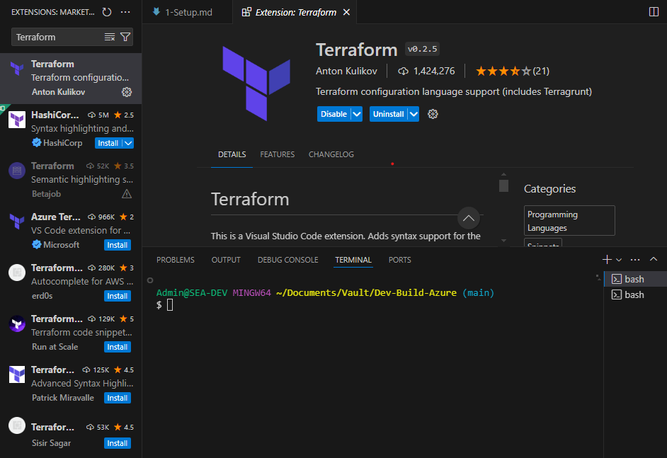

# Install Azure CLI

- [Install Azure CLI for your Operating System](https://learn.microsoft.com/en-us/cli/azure/install-azure-cli)
- Run ```az login``` select your login method 
```bash
Please select the account you want to log in with.

Retrieving tenants and subscriptions for the selection...

[Tenant and subscription selection]

No     Subscription name    Subscription ID                       Tenant
-----  -------------------  ------------------------------------  -------------------------------
[1] *  CS-SUBM-0495         7d6101fe-5829-40e8-bb5e-e7e33285d25e  go deploy Ltd (t006.gdazcs.com)

The default is marked with an *; the default tenant is 'go deploy Ltd (t006.gdazcs.com)' and subscription is 'CS-SUBM-0495' (7d6101fe-5829-40e8-bb5e-e7e33285d25e).

Select a subscription and tenant (Type a number or Enter for no changes): 1
```
or ```az login --use-device-code``` by pasting the URL on the browser and device code to login.

- Install the Terraform Extension on VS Code (```Terrform by Anton Kulikov```)


- Verify with ```az account show``` command
```bash
$ az account show
{
  "environmentName": "AzureCloud",
  "homeTenantId": "6b9ee64f-5016-40ce-a4fd-5a6befae31ef",
  "id": "7d6101fe-5829-40e8-bb5e-e7e33285d25e",
  "isDefault": true,
  "managedByTenants": [],
  "name": "CS-SUBM-0495",
  "state": "Enabled",
  "tenantDefaultDomain": "t006.gdazcs.com",
  "tenantDisplayName": "go deploy Ltd (t006.gdazcs.com)",
  "tenantId": "6b9ee64f-5016-40ce-a4fd-5a6befae31ef",
  "user": {
    "name": "student6Z7HU@t006.gdazcs.com",
    "type": "user"
  }
}
```